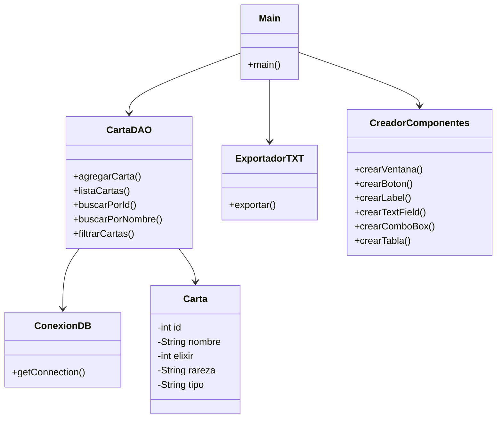

# Clash Royale Database - Sistema de Gestión de Cartas con Java y PostgreSQL

Proyecto desarrollado en Java utilizando Swing, JDBC y PostgreSQL para gestionar una base de datos de cartas de Clash Royale mediante una interfaz gráfica.

Solución desarrollada para el segundo parcial de Programación Orientada a Objetos (POO) de la Universidad Distrital.

---

# Funcionalidades

* Adicionar cartas a la base de datos
* Mostrar todas las cartas registradas
* Buscar cartas por:

  * ID
  * Nombre
* Filtrar cartas por:

  * Elixir
  * Rareza
  * Tipo
* Exportar resultados a archivos `.txt`
* Validación de datos ingresados por el usuario
* Manejo de errores y mensajes informativos mediante interfaz gráfica

---

# Tecnologías utilizadas

* Java
* Swing
* JDBC
* PostgreSQL
* Neon Database
* IntelliJ IDEA

---

# Estructura del proyecto

```plaintext
src
│
├── dao
│   ├── ConexionDB.java
│   └── CartaDAO.java
│
├── model
│   └── Carta.java
│
├── ui
│   ├── CreadorComponentes.java
│   └── Ventanas
│       ├── VntInsertar.java
│       ├── VntMostrar.java
│       ├── VntBuscar.java
│       └── VntFiltrar.java
│
├── util
│   └── ExportadorTXT.java
│
└── Main.java
```

---

# Explicación de paquetes

## model

Contiene la clase `Carta`, utilizada para representar cada carta almacenada en la base de datos como un objeto Java.

## dao

Contiene:

* `ConexionDB`: maneja la conexión con PostgreSQL.
* `CartaDAO`: contiene las consultas SQL y operaciones sobre la base de datos.

## ui

Contiene:

* `Main`: ventana principal de la aplicación.
* `CreadorComponentes`: centraliza la creación de componentes gráficos reutilizables.
* Ventanas individuales para cada funcionalidad del sistema.

## util

Contiene:

* `ExportadorTXT`: permite generar archivos `.txt` con los resultados de las consultas realizadas.

---

# Base de datos

Tabla utilizada:

```sql
CREATE TABLE cartas (
    id SERIAL PRIMARY KEY,
    nombre VARCHAR(50),
    elixir INT,
    rareza VARCHAR(30),
    tipo VARCHAR(30)
);
```

---

# Cómo ejecutar el proyecto

1. Clonar el repositorio:

```bash
git clone https://github.com/nicolas-sm25/Clash-Royale-BD.git
```

2. Abrir el proyecto en IntelliJ IDEA

3. Agregar el driver JDBC de PostgreSQL

4. Configurar las credenciales en `ConexionDB.java`

```java
private static final String URL = "...";
private static final String USER = "...";
private static final String PASS = "...";
```

5. Ejecutar:

```java
Main.java
```

---

# Funciones disponibles dentro de la aplicación

```plaintext
1. Insertar carta
2. Mostrar base de datos
3. Buscar carta
4. Filtrar cartas
5. Salir
```

---

# Conceptos aplicados

* Programación Orientada a Objetos
* Swing
* JDBC
* DAO Pattern
* PreparedStatement
* ResultSet
* Validación de datos
* Manejo de excepciones
* Mapeo Objeto-Relacional
* Reutilización de componentes
* Separación de responsabilidades

---

## Diagrama UML



---

# Autor

Nicolás Soriano Medina
20251020110  
Universidad Distrital Francisco José de Caldas
